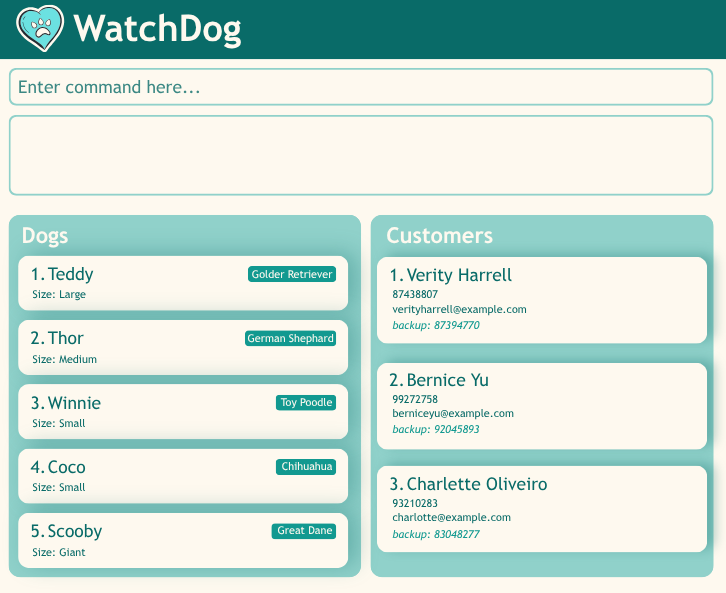

* This is **an application used to manage a dog daycare centre’s customer and dog information.**. 
  Example usage:
  * Track, manage and search a database of dogs and clients.
  * It is **written in an object-oriented programming (OOP) style** and provides a **reasonably well-written** codebase of about 6 KLoC.
  * It comes with a **reasonable level of user and developer documentation**.
* It is named `WatchDog` to reflect the function of a dog daycare, as well as the role of its manager in 'watching over' the dogs.
* For the detailed documentation of this project, see the **[Address Book Product Website](https://ay2627s1-cs2103t-t15-4.github.io/tp/)**.
* This project is based on the AddressBook-Level3 project created by the [SE-EDU initiative](https://se-education.org).
