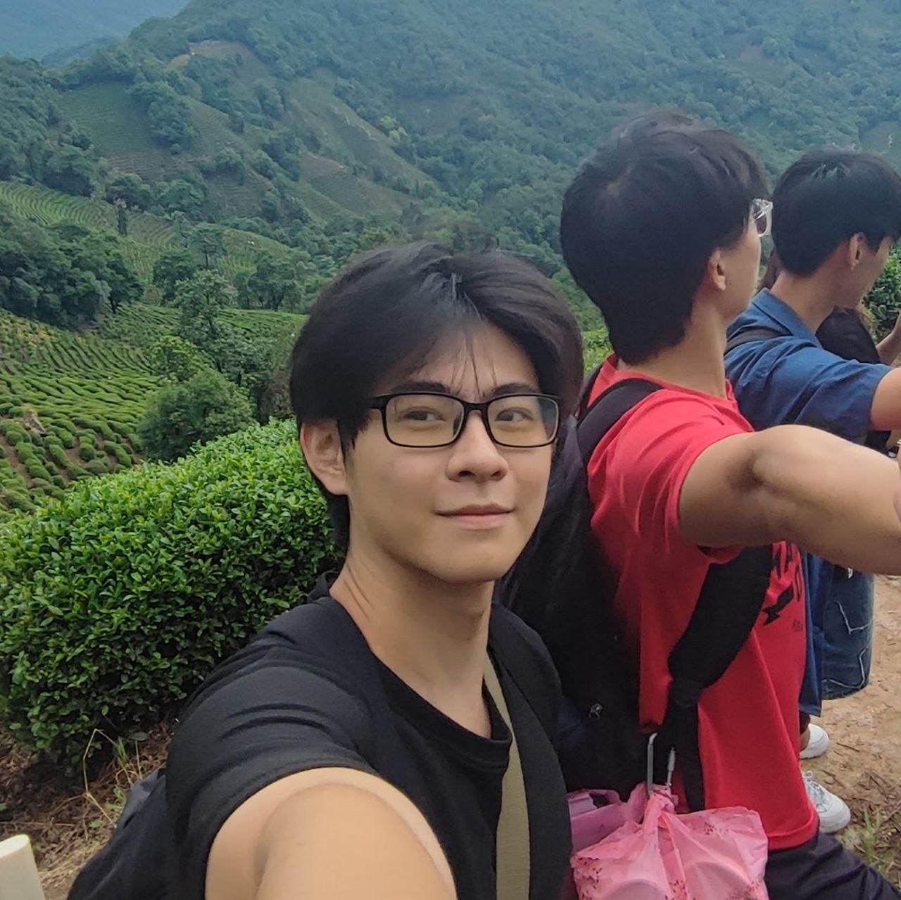
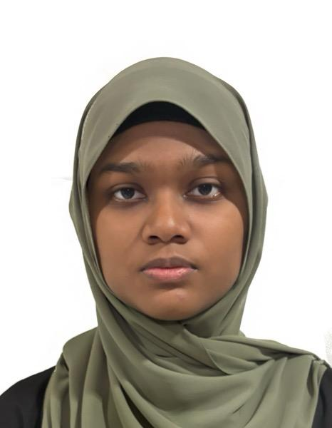

# About Us

We are a team based in the [School of Computing, National University of Singapore](http://www.comp.nus.edu.sg).

You can reach us at the email `seer[at]comp.nus.edu.sg`

## Project team

### Shou An

[[github](https://github.com/its-shoutime)]

* Role: Project Advisor
* Responsibilities: Testing, Documentation, Coordinator

### Kenneth Chia

[[github](http://github.com/Kenneth-Chia)]

* Role: Team Lead
* Responsibilities: UI, Code Quality, Testing

### Xander Goh

[[github](http://github.com/xandergoh)]
[[portfolio](team/johndoe.md)]

* Role: Developer
* Responsibilities: Data, Debugging, Testing

### Umaiza

[[github](https://github.com/Umaiza-15)]

* Role: Developer
* Responsibilities: testing, scheduling, UI

### Aseera Jannath

[[github](http://github.com/lilosy)]

* Role: Developer
* Responsibilities: Testing, UI, Code quality
